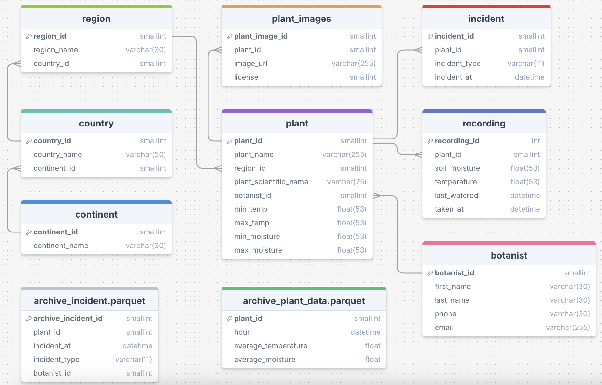

# Database

This folder has all the necessary files for the dashboard.

### Requirements

- SQL Server

NOTE: When connecting to the database ensure that server certificate is trusted. When connecting via the terminal the -C argument must be passed. 

### schema.sql

An SQL file for creating the database.

### ERD.png

An entity relationship diagram to visualise the database structure:

